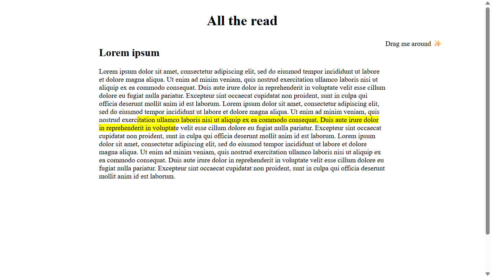
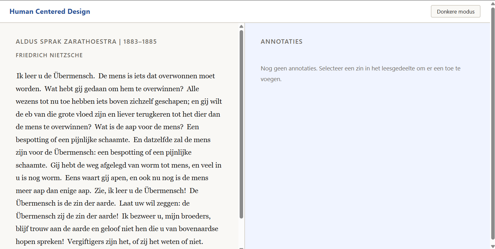
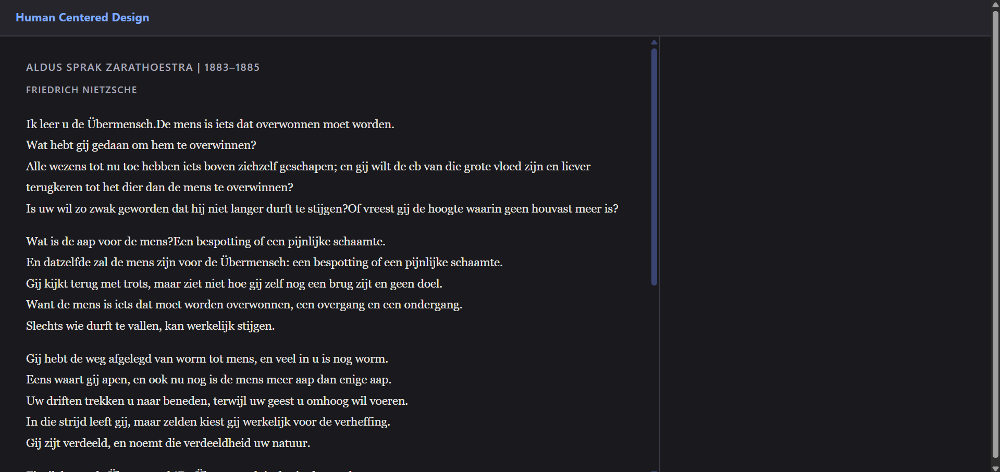
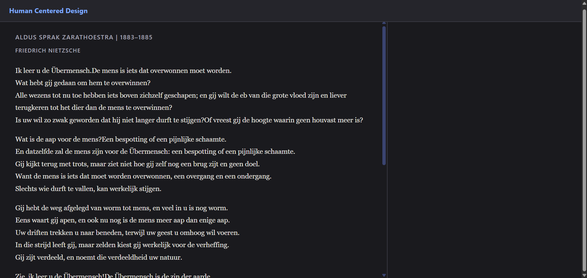
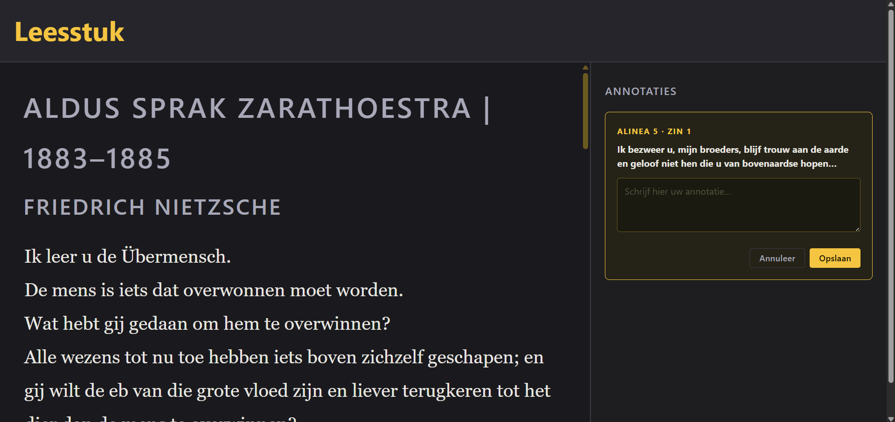

# Human-Centered-Design
Website voor het vak HCD (Human Centered Design)

<h>Week 1</h1>

<h2>Dag 1 (30-03-2026)</h2>
<h3>Wat heb ik gedaan vandaag?</h3>

Ik ben vandaag begonnen met het maken van een begin van de nieuwe opdracht. WIj moeten een website/applicatie maken voor mensen met een bepaalde beperking. Ik en een hand andere studenten hebben Roger gekregen als test persoon. Hij heeft maculadegeneratie en zijn zicht wordt steeds slechter. Ik ben begonnen met het voorbereiden welke vragen ik hem zal stellen tijdens het gesprek om meer informatie op te doen.   

<h3>Hoelang heb ik er aan gewerkt?</h3>

Ik heb ongeveer de heledag gewerkt aan het begrijpen van de opdracht en het voorbereiden van de vragen. Ik heb ook gewerkt aan een kleine idee dat ik had en had ik in een half uur af. De laatste uur heb ik gebruikt voor de checkout.

<h3>Wat heb ik geleerd?</h3>

Ik heb niet echt iets nieuws geleerd. Vandaag was meer het begin maken en kijken wat ik wou maken als eind opdracht.

<h3>Wat ga ik morgen doen?</h3>

Ik ga morgen voorbereiden voor het gesprek met Roger en alvast nadenken wat mijn eindproduct wordt.

<h3>Bronnen</h3>

Geen bronnen gebruikt vandaag.

<h2>Dag 2 (31-03-2026)</h2>
<h3>Wat heb ik gedaan vandaag?</h3>

We hebben een gesprek gehad met Roger en ik heb allerlei inzichten gekregen door het gesprek. We kregen wat meer te weten van hoe zijn conditie er uitziet en hoe het hem beïnvloedt in zijn dagelijks leven. Ik had een kleine prototype gemaakt waar ik dacht dat het zou werken. Maar uiteindelijk bleek dat niet zo te zijn. Ik had voor het gesprek onderzoek gedaan naar Roger zijn aandoening en ik zag het als alleen maar een vlekje in de midden van zijn zicht. Ik heb daarom een tekst column gemaakt dat verplaatst kan worden naar de zijkant. Ik wist dus niet dat het midden van zijn zicht bepaald is door de kant waar hij kijkt. Dus als hij focust op een tekst dan wordt de tekst bedekt ookal is het aan de zijkant, midden of onder aan het scherm. Dit heeft me laten zien dat testen en vragen stellen een hele belangrijke stap is van alles. We hebben verder nog besproken wat Roger nou eigenlijk wil zien. 

<h3>Hoelang heb ik er aan gewerkt?</h3>

Ik ben ongeveer 2 uurtjes voor het gesprek bezig geweest met het maken van een prototype en het voorbereiden van de vragen. Na het gesprek heb ik nog wat ideeen opgeschreven.

<h3>Wat heb ik geleerd?</h3>

Dat testen en vragen stellen een belangrijke stap is in het ontwikkelproces.

<h3>Wat ga ik morgen doen?</h3>

Morgen beginnen we aan het nieuwe vak API. Maar ik wil voor het volgende gesprek wel een verbeterde versie van mijn prototype hebben. 

<h3>Bronnen</h3>

Geen bronnen gebruikt vandaag.

<h2>Dag 3 (07-04-2026)</h2>
<h3>Wat heb ik gedaan vandaag?</h3>

Ik heb een verbeterde versie van mijn prototype gemaakt en de vragen voor het volgende gesprek voorbereid. Ik heb me gefocussed op een prototype dat wat beter werkt met een screen reader. Omdat Roger alleen met de screen reader nu kan lezen, heb ik gefocused op het lezen van zin per zin. Hij kan dan per zin een annotation toevoegen. Verder heb ik nog gekeken of ik wat kan toevoegen uit alle bevindingen, zoals contrast en grootte.

<h3>Hoelang heb ik er aan gewerkt?</h3>

We waren twee uur bezig met het testen en het noteren van de bevindingen.

<h3>Wat heb ik geleerd?</h3>

Ik heb geleerd dat het belangrijk is dat je continue interaties maakt zodat de test persoon steeds iets nieuws heeft om te testen en zodat je meer bevindingen kan doen. .

<h3>Wat ga ik morgen doen?</h3>

Ik ga nieuwe ideeen bedenken voor mijn volgende prototype uit de bevindingen die we vandaag hebben gekregen. .

<h3>Bronnen</h3>

Geen bronnen gebruikt vandaag.

<h2>Dag 4 (13-04-2026)</h2>
<h3>Wat heb ik gedaan vandaag?</h3>

Ik heb een verdere interatie gemaakt van mijn prototype. Ik heb de contrast aangepast en gekeken naar de screenreader. Ik ben er achter gekomen dat de screenreader bepaalde woorden niet goed uitsprak. Bijvoorbeeld jaar getallen. Dit klonk niet natuurlijk, maar heel vreemd. De screenreader las elke losse getal op wat leidde tot een rare eindresultaat. Ik heb dit kunnen oplossen met de hulp van mijn docent. Ik heb verder gekeken of ik ook het irritanten "knop" aan het einde van de screenreader kon veranderen. Dit kwam dus blijkbaar omdat de zinnen in een span worden gezet met javascript en dat leidde tot dat elke nieuwe knop werdt opgenoemd door de screenreader. Als ik inplaats van span het een button laat maken blijft de screenreader alleen de tekst lezen. En doordat het allemaal met javascript is gemaakt kan ik allerlei verschillende teksten in toevoegen en het werkt hetzelfde. 

<h3>Hoelang heb ik er aan gewerkt?</h3>

Ik heb hier de hele dag aan gewerkt, en er was geen checkout vandaag.

<h3>Wat heb ik geleerd?</h3>

Ik heb geleerd dat het belangrijk is dat je zelf ook test met een screenreader want je komt altijd met onverwachte problemen en bevindingen.

<h3>Wat ga ik morgen doen?</h3>

Morgen is weer een test met Roger en het wordt hoogswaarschijnlijk hetzelfde als de vorige keer. Zo veel mogelijk bevindingen verzamelen en verbeteren voor de volgende test.

<h3>Bronnen</h3>

Geen bronnen gebruikt vandaag.

<h2>Dag 5 (14-04-2026)</h2>
<h3>Wat heb ik gedaan vandaag?</h3>

We hebben een nieuwe test uitgevoerd met Roger en de bevindingen geanalyseerd. Ik ben er achtergekomen dat Roger ookal kan hij amper zien dat hij het nogsteeds fijn vind dat hij weet waar hij is met behulp van hele grote tekst en velle kleuren zoals geel. Ik heb ook zelf als feedback gekregen om mijn annotaties te verbeteren. Roger wou bijvoorbeeld dat hij annotaties kan terug vinden met alineas en regel nummers zodat hij weet welke het is.

<h3>Hoelang heb ik er aan gewerkt?</h3>

Wij zijn twee uur bezig geweest met het testen en noteren van de bevindingen.

<h3>Wat heb ik geleerd?</h3>

Niet perse iets nieuws maar ik wordt steeds beter en beter in het testen en analyseren wat een gebruiker nou eigenlijk wil en suggesties bedenken hoe het beter kan.

<h3>Wat ga ik morgen doen?</h3>

Ik ga voor de volgende keer mijn laatste prototype creeren en zo veel mogelijk bevindingen toevoegen aan die prototype zodat ik het beste resultaat kan behalen. 

<h3>Bronnen</h3>

Geen bronnen gebruikt vandaag.

<h2>Dag 6 (20-04-2026)</h2>
<h3>Wat heb ik gedaan vandaag?</h3>

Vandaag zijn we begonnen met een check in van vasilis. We hebben gekeken naar exculsive design en hoe het een best handige principe is. Ik heb gekeken hoe ik er verder nog aan mijn website kan werken met deze principe onderandere de "add nonsense" principe. Ik heb verbeteringen gemaakt met het contrast en de grootte van de tekst en ik heb een willekeurige knop toegevoegd om te switchen tussen het leesgedeelte en het annotatie gedeelte.

<h3>Hoelang heb ik er aan gewerkt?</h3>

De hele les was ik hieraan bezig. De laatste uur heb ik een check out gedaan.

<h3>Wat heb ik geleerd?</h3>

Ik heb geleerd dat prototypes wel saai kunnen worden dus om het wat leuker te maken voor de gebruiker kan je de exclusive design principe gebruiken van Vasilis.

<h3>Wat ga ik morgen doen?</h3>

Morgen is het laatste dag van de testen met Roger dus ik ga mij daar voor voorbereiden.

<h3>Bronnen</h3>

Geen bronnen gebruikt vandaag.

<h2>Dag 7 (21-04-2026)</h2>
<h3>Wat heb ik gedaan vandaag?</h3>

Vandaag was de laatste dag van de testen met Roger. Ik heb mijn laatste prototype laten zien en hij vond gelijk dat hij veel sneller kon vinden waar hij was. Ik ben wel achter gekomen dat mijn willekeurige knop het niet doet door de screenreader zelf. Jelle had het zelfde probleem en het kwam omdat de knop die ik heb gekozen "K" al gebruikt was door de screenreader dus dit zorgde ervoor dat het niet te gebruiken was.

<h3>Hoelang heb ik er aan gewerkt?</h3>

Het testen was weer twee uurtjes.

<h3>Wat heb ik geleerd?</h3>

Ik heb geleerd dat het belangrijk is dat je altijd zelf met de screenreader te werk gaat en niet wacht tot dat iemand anders zulke fouten naar boven brengt. Dit kon makkelijk gefixt worden als ik het eerder had getest met een screenreader.

<h3>Wat ga ik morgen doen?</h3>

De volgende keer ga ik de laatste finishing touches aanbrengen, laatste keer door alles heen met een screenreader en hopen dat ik het beste product kan leveren. 

<h3>Bronnen</h3>

Geen bronnen gebruikt vandaag.

<h2>Herkansing</h2>

Ik heb na het gesprek met Leonie nog een paar aanpassingen gedaan die mijn prototype nog beter maken. Als eerst wil ik dat bij elke zin de screenreader stopt met het lezen van wat de geselecteerde veld is. In mijn geval is dat "knop" omdat het letterlijk een knop is. Ik heb dit kunnen fixen door de knop te veranderen naar een "span". Ik moest wel een aria label toevoegen en een tabindex zodat het nogsteeds klikbaar is. Verder heb ik gekeken of ik de navigate voor de navigate panel kan verbeteren. Ik wil kunnen tabben door de verschillende annotaties als die zijn gemaakt. Ik heb dit kunnen fixen om de annotaties in een lijst te zetten. Dit is ook het juiste manier volgens Leonie. Tot slot moest ik beter documenteren hoe ik de principes van Vasilis heb toegepast in mijn website. Dit doe ik hieronder. 

<h2>Exclusive design principes</h2>

Je hebt de volgende principes van exclusive design:

<ul>
<li>Study situation</li>
<li>Ignore conventions</li>
<li>Prioritise identity</li>
<li>Add nonsense</li>
</ul>

Voor study situation heb ik veel onderzoek gedaan naar wat Roger precies geeft en wat hij nodig heeft. Hier kom je achter als je gaat testen. Je moet zoveel mogelijk vragen stellen en luisteren naar de gebruiker. Roger wordt steeds blinder en moet daarom steeds meer gebruik maken van zijn screenreader. Dus het is slim dat je begint met een prototype dat goed werkt met een screenreader. Het is ook belangrijk dat je geen input geeft wanneer een test persoon je prototype test. Je moet alleen maar luisteren en vragen stellen.

Voor ignore conventions is het een beetje het zelfde als study situation. Je kan niet kijken naar conventions wanneer iedereen anders is. Roger wilt bijvoorbeeld erge contrasten en grote tekst zodat het wat fijner voor hem is om nog een beetje te kunnen lezen van wat hij nog kan zien. Daarom is bijvoorbeeld light mode/de standaar contrast niet goed voor hem. Je moet wat anders verzinnen en dit koppelt weer goed terug met het testen van je prototype. Je komt op verschillende bevindingen en je kan daar je eigen conventions op maken die beter werken voor jouw gebruiker. 

Voor prioritise identity is het belangrijk dat je de iets van de gebruiker kan toevoegen aan je prototype dat identiteit geeft. Roger had niet echt iets dat hij graag wou terug zien in zijn ideale prototype dat hem een gevoel van identiteit geeft. Ik heb jammer genoeg ook niet echt iets kunnen bedenken dat ik aan mijn prototype kon toevoegen dat een gevoel van identiteit geeft. Alles was heel erg praktisch en functioneel gericht. 

Voor add nonsense is het echt thinking outside the box. Je moet praten met de test persoon en kijken of er een gek idee is dat juist kan helpen met de functionaliteit van je prototype. Ik had eerst een idee dat ervoor zorgde dat je een stuk tekst kon selecteren en verplaatsen naar een kant van het scherm zodat Roger dit kon zien. Natuurlijk is dit een gek idee en ik was best trots op dit idee, alleen werkte dit helemaal niet, omdat ik dus niet goed heb gekeken/nagedacht over zijn conditie. Nu heeft Roger ook niet echt iets dat hij graag zou willen zien behalve meer practische dingen dat niet echt nonsense zijn. 

